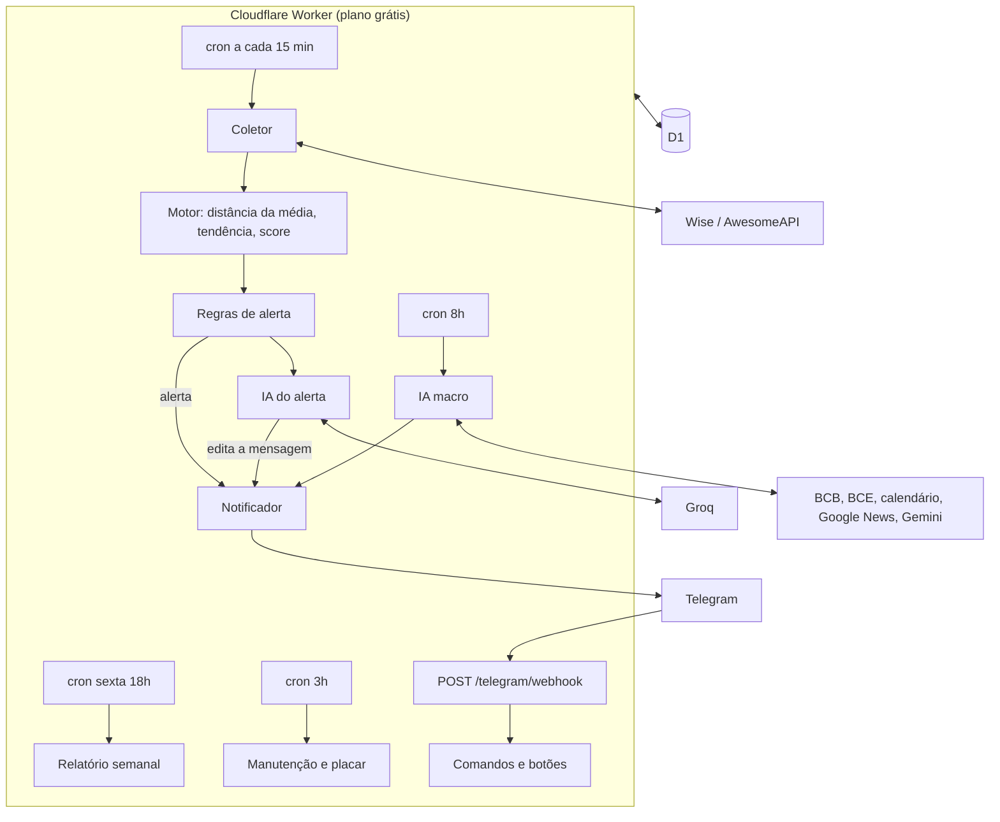

# Euro Alert: plano de desenvolvimento

> Versão 2.1 · 24/09/2026 · foco em alertas e boas épocas de compra (o app não trata de dinheiro)
> Stack: TypeScript + Cloudflare Workers (plano grátis) + D1 + Telegram · Custo: R$ 0

## Sumário

1. [Objetivo e escopo](#1-objetivo-e-escopo)
2. [Princípios](#2-princípios)
3. [Sinais e alertas](#3-sinais-e-alertas)
4. [O que a pesquisa mostrou](#4-o-que-a-pesquisa-mostrou)
5. [Arquitetura](#5-arquitetura)
6. [Modelo de dados (D1)](#6-modelo-de-dados-d1)
7. [Integrações](#7-integrações)
8. [Bot do Telegram](#8-bot-do-telegram)
9. [Camada de IA](#9-camada-de-ia)
10. [Etapas de desenvolvimento](#10-etapas-de-desenvolvimento)
11. [Testes](#11-testes)
12. [Limites do plano grátis](#12-limites-do-plano-grátis)
13. [Riscos](#13-riscos)
14. [Decisões pendentes](#14-decisões-pendentes)
- [Apêndice A: pesquisa](#apêndice-a-pesquisa)
- [Apêndice B: formatos das APIs](#apêndice-b-formatos-das-apis)
- [Apêndice C: modelos de mensagem](#apêndice-c-modelos-de-mensagem)

---

## 1. Objetivo e escopo

O app acompanha o EUR/BRL o tempo todo (com base na Wise), identifica **boas épocas para comprar euro**, avisa no Telegram e dá contexto com IA: uma leitura do momento do preço e um resumo macro com notícias. Uso pessoal, custo zero.

**Fora do escopo:** quanto comprar, orçamento, registro de compras e divisão de investimentos. O app informa; a decisão e a execução são suas.

| Tema | Decisão |
|---|---|
| Linguagem e infra | TypeScript em Cloudflare Workers (plano grátis), banco D1 (SQLite) |
| Canal | Bot do Telegram |
| Cotação | API oficial da Wise com token pessoal. Reservas: endpoint público da Wise e AwesomeAPI |
| Sinal principal | Boa época: euro 3% ou mais abaixo da média dos últimos 12 meses, com níveis −5% e −8% e saída quando volta acima de −3% (seção 3.1) |
| Contexto do alerta | 12 meses (o gatilho), 5 anos e a história desde 2002 corrigida pela inflação (seção 3.2), mais o custo na Wise |
| Horário dos alertas | 8h às 22h em dias úteis. O câmbio que a Wise usa funciona 24 horas nos dias úteis (seção 3.4) |
| Meta de preço | Não tem. As referências são as médias de 12 meses, de 5 anos e da história |
| IA do alerta | Groq (`openai/gpt-oss-120b` e `openai/gpt-oss-20b`). Reservas: Cerebras e OpenRouter |
| IA macro | Gemini 2.5 Flash com busca no Google, em duas passadas. Reserva: manchetes por RSS + Groq |
| Histórico para estudo | Público (24 anos do BCE, 5 anos da Wise, ~3 anos por hora do Yahoo). Não depende de acumular dados próprios |

## 2. Princípios

1. **A regra fixa dispara o alerta, a IA dá contexto.** A IA nunca dispara nem bloqueia um alerta de preço.
2. **O gatilho olha só o preço do euro.** Toda régua de alerta é calculada sobre a série do EUR/BRL (média de 12 meses, 5 anos, câmbio real, tendência). Selic, juro do BCE, Focus e notícias são contexto para a IA e para o resumo, nunca gatilho (decidido em 05/10/2026).
3. **Honestidade sobre o sinal.** O sinal "barato em relação ao último ano" funcionou muito bem em alguns períodos e mal em outros (seção 3.3). Cada alerta mostra o contexto, e o app mede os próprios acertos (placar, seção 3.6).
4. **O motor é feito de funções puras.** O mesmo código roda em produção, nos testes e no backtest.
5. **Falhar alto.** Se algo parar, você fica sabendo (sinal de vida diário e vigia de dados).
6. **Nenhuma mudança de regra entra sem backtest.**
7. **Tudo cabe no plano grátis, com folga** (seção 12).
8. **Nenhum dado pessoal vai para as IAs**, só dados de mercado.

---

## 3. Sinais e alertas

### 3.1 Boa época (sinal principal)

**Definição:** `distância = preço ÷ média dos últimos 250 dias úteis (~12 meses) − 1`.

| Nível | Distância | % dos dias no histórico (BCE 2002–26) | % dos dias (Wise 2022–26) |
|---|---:|---:|---:|
| Boa | ≤ −3% | 28% | 19% |
| Muito boa | ≤ −5% | 21% | 10% |
| Rara | ≤ −8% | 13% | 3% |

**Saída:** a época começa quando a distância chega a −3% e termina quando ela volta acima de −3%, sem histerese (decidido em 05/10, antes era −1%). A época passa a marcar só o tempo em que o euro está de fato 3% abaixo da média. O custo é mais liga-desliga:

| Saída | Épocas/ano (BCE 2002–26) | Duração mediana (BCE) | Épocas de até 5 dias (BCE) | Reabre em até 10 dias úteis (BCE) | Épocas/ano (Wise 2022–26) | Duração mediana (Wise) |
|---|---:|---:|---:|---:|---:|---:|
| −1% (antes) | 1,3 | 29 d.u. | 2 de 31 | 4 | 2,0 | 20 d.u. |
| −2% | 1,9 | 12 d.u. | 11 de 46 | 15 | 2,5 | 10 d.u. |
| −2,5% | 2,7 | 6 d.u. | 31 de 63 | 31 | 2,7 | 10 d.u. |
| **−3% (atual)** | 3,4 | 4 d.u. | 50 de 80 | 48 | 3,7 | 5 d.u. |

**Confirmação:** para abrir ou fechar uma época, a condição precisa se manter em duas leituras seguidas (30 minutos). Isso evita alerta por ruído de uma leitura isolada.

**Por que esses níveis** (decididos em 24/09):
- **−3%:** o EUR/BRL oscila ~14% ao ano, o que dá ~4% num mês típico. Então −3% é uma queda de tamanho normal: o euro passa ~28% dos dias abaixo dele. É frequente o bastante pra ser útil e raro o bastante pra importar.
- **−5% e −8%:** separam o comum do raro. Com saída em −1%, metade das épocas chegou a −5% e um quarto chegou a −8%.
- **Saída em −3%:** a época só dura enquanto o euro está barato de fato. Se o liga-desliga incomodar, −2% é o meio-termo (tabela acima). O valor fica em `exitLevel` na configuração.
- **Total:** ~8 alertas de época por ano (início, níveis e fim), contra ~3,5 com saída em −1%.
- **Ajustes:** os valores ficam na configuração, e a Etapa 5 confirma ou ajusta com walk-forward.

**Alertas gerados:**
- **Boa época começou**, com o nível atual.
- **Boa época ficou melhor**, uma vez por nível novo (−5% e −8%).
- **Boa época terminou**, com o resumo do episódio: duração, ponto mais baixo e data.

**Contexto em cada alerta:**
- os três horizontes da seção 3.2: 12 meses, 5 anos e história;
- tendência: se a média de 12 meses está subindo ou caindo, e onde o preço está em relação às médias de 20 e 50 dias;
- de onde veio o movimento: EUR/USD ou USD/BRL;
- sazonalidade do mês (dezembro é o mais caro, junho e julho os mais baratos);
- eventos próximos (Copom, BCE, Fed, eleição);
- custo na Wise (tarifa + IOF) para R$ 1.000 de referência;
- comentário da IA, que chega alguns segundos depois.

### 3.2 Contexto: 12 meses, 5 anos e história

O gatilho é a média de 12 meses, mas o alerta sempre mostra os três horizontes:

| Horizonte | O que mostra | Hoje (23/09/2026, BCE 5,8564) |
|---|---|---|
| 12 meses | distância da média, e mais barato que X% dos dias do período | média 6,0543 (−3,3%) · mais barato que 82% dos dias |
| 5 anos | distância da média, e mais barato que X% dos dias do período | média 5,8042 (+0,9%) · mais barato que 48% dos dias |
| História desde 2002 | câmbio corrigido pela inflação do Brasil (IPCA) e da zona do euro, em reais de hoje | média 5,4013 (+8,4%) · mais barato que 30% dos dias |

**Por que corrigir pela inflação:** sem correção, o preço de hoje pareceria mais caro que 84% dos dias desde 2002, só porque o real perdeu valor com a inflação acumulada. Em reais de hoje, o euro mais barato da história foi 3,67 (fev/2012) e o mais caro, 9,43 (set/2002).

**Leitura de hoje:** barato em relação ao último ano, na média dos últimos 5 anos e caro em relação à história.

O contexto de 5 anos e da história é informação, não gatilho. Testei se "12 meses ≤ −3% e abaixo da média de 5 anos" melhora o sinal:
- em 2021–25 ficou bem melhor: 4,8% abaixo da média dos 6 meses seguintes;
- em 2007–14 ficou um pouco pior;
- em 2015–20 a combinação nem aconteceu.

O câmbio real também não separou bem os casos (Apêndice A.2).

### 3.3 O que o histórico diz sobre a boa época

Medi o preço dos dias de boa época contra a média dos 6 e dos 12 meses seguintes, descontando o que um dia qualquer consegue. O euro tem tendência de alta de longo prazo, então qualquer dia costuma ficar abaixo da média futura. Negativo = a boa época foi melhor que um dia qualquer:

| Período | Boa época vs dia qualquer (6 meses seguintes) |
|---|---:|
| BCE 2003–2008 | −1,0% (melhor) |
| BCE 2009–2014 | +1,8% (pior) |
| BCE 2015–2020 | +2,0% (pior) |
| BCE 2021–2025 | −1,2% (melhor) |
| Wise 2022–2025 | −3,2% (melhor; preço abaixo da média seguinte em 100% dos dias) |
| **BCE 2004–2025 inteiro** | **+0,7% (pior)** |

- **Funciona quando o câmbio anda de lado e volta à média**, como nos últimos 4 anos.
- **Falha quando o real está em tendência**: nesses períodos o euro barato continuou caindo, e o euro caro continuou subindo.
- **Os filtros testados não resolveram na base longa**: exigir média de 12 meses subindo, ou preço acima das médias de 20 e 50 dias.

Por isso o alerta diz exatamente o que é verdade ("o euro está barato em relação ao último ano") e traz o contexto de tendência. A IA do alerta ajuda a separar desconto temporário de tendência, e o placar (3.6) mostra se o sinal está funcionando no regime atual.

### 3.4 Horário dos alertas

- **Câmbio usado pela Wise:** funciona 24 horas nos dias úteis. Fecha na sexta às 17h de Nova York (18h ou 19h em Brasília, conforme o horário de verão americano) e reabre segunda às 9h de Auckland (domingo à noite em Brasília). No fim de semana, a Wise usa o último preço de sexta. Quando você cria a transferência, ela garante a cotação por 2 a 48 horas.
- **Mercado brasileiro (B3):** tem horário fixo (futuro de dólar das 9h às 18h; à vista das 10h às 16h55). É ali que o real mais negocia, então os movimentos maiores costumam acontecer nesse período, mas ele não limita as transações na Wise.
- **Regra adotada** (mercado 24h): alertas das **8h às 22h**, de segunda a sexta. O que acontecer das 22h às 8h vai para o resumo das 8h. O coletor continua rodando a cada 15 minutos nos dias úteis.

### 3.5 Outros alertas

| Alerta | Regra | Padrão |
|---|---|---|
| Dia excepcional | score de curto prazo ≥ percentil 95 (seção 3.7); ~13 por ano, 9 deles dentro de boa época | só no resumo diário |
| Disparada | euro sobe 3% ou mais em 5 dias úteis | ligado |
| Evento | véspera de Copom, BCE, Fed ou eleição | ligado |
| Sazonal | 1º dia útil de dezembro (mês mais caro) e de junho (começo do período mais barato) | ligado |
| Sistema | coleta parada, fonte reserva em uso, cota de IA esgotada | ligado |

**Contra excesso de alertas:**
- Cada nível de boa época avisa uma vez por episódio.
- Fora do horário (22h às 8h), o alerta vai para o resumo das 8h.
- No máximo 3 notificações por dia (fora as de sistema).
- O botão 🔕 silencia os alertas por 24 horas.

### 3.6 Placar dos alertas

Todo alerta de boa época fica salvo com o preço do momento. A manutenção diária completa depois de 1, 3 e 6 meses:
- a média do preço em cada janela;
- quanto o preço ainda caiu depois do alerta (mínimo da janela).

O `/placar` e o relatório semanal mostram, por exemplo: "épocas no último ano: 2; preço no início ficou em média 2,1% abaixo da média dos 3 meses seguintes; depois do alerta o euro ainda caiu em média 1,4%".

No backfill, o placar já é calculado com as épocas dos últimos 5 anos. Assim, desde o primeiro dia dá pra ver como o sinal se saiu.

### 3.7 Score de curto prazo (contexto)

Média ponderada de componentes normalizados entre 0 e 1, virando um número de 0 a 100. Não é gatilho de compra: aparece no contexto e no alerta opcional de dia excepcional.

| Componente | Cálculo | Peso |
|---|---|---:|
| Percentil | 1 − percentil do preço nos últimos 90 dias úteis | 35% |
| Distância da média curta | z-score contra a média de 20 dias: `clip(−z/2,5; 0; 1)` | 25% |
| RSI | RSI(14) de Wilder: `clip((50 − RSI)/20; 0; 1)` | 15% |
| Queda recente | retorno de 5 dias sobre 1,5 desvio da volatilidade de 60 dias: `clip(−r5/(1,5·σ·√5); 0; 1)` | 15% |

Os pesos somam 90% e o total é dividido por 0,90, igual à pesquisa (`indicators()` em `research/analise_preliminar.py`).

### 3.8 Como está hoje

Em 05/10/2026, 11h30 (primeiro sinal calculado em produção, Wise pública), um dia depois do 1º turno da eleição:
- **Preço:** EUR/BRL 5,5776 (caiu ~4,7% em relação a sexta).
- **12 meses:** −7,6% da média (6,04), mais barato que 99,6% dos dias do último ano. Nível **muito boa**, perto de **rara** (−8%).
- **5 anos:** −3,7% da média (5,79), mais barato que 58% dos dias.
- **História:** +3,2% da média corrigida pela inflação (5,41), mais barato que 38% dos dias desde 2002.
- **Tendência:** média de 12 meses caindo (−1,7% em 3 meses); preço abaixo das médias de 20 e 50 dias.
- **Projeção pela volatilidade:** 68% de chance de ficar entre 5,47 e 5,69 em 1 semana, e entre 5,37 e 5,80 em 1 mês.
- **Sazonalidade:** outubro costuma ficar 0,8% acima da tendência (24 anos).

Em 23/09/2026 (BCE 5,8564): 12 meses −3,3% (boa época desde 22/09), 5 anos +0,9%, história +8,4%. A história foi recalculada com a série nova de inflação do euro da Eurostat (antes dava +6,6%).

---

## 4. O que a pesquisa mostrou

Resumo. Os números completos estão no [Apêndice A](#apêndice-a-pesquisa), e os scripts em `research/`.

| Tema | Resultado | Uso no app |
|---|---|---|
| Boa época (abaixo da média de 12 meses) | Depende do regime: ótima em mercado de lado, ruim em tendência | sinal principal, com contexto e placar |
| Timing de curto prazo (score, dias de queda) | Sem vantagem robusta em 24 anos; empata com dias sorteados | só contexto e alerta opcional |
| Hora do dia | Diferença ≤ 0,02% entre as horas | nenhum; alertas das 8h às 22h |
| 5 anos e história corrigida pela inflação | Bons para situar o preço; não melhoraram o gatilho de forma consistente | contexto em todo alerta |
| Mês do ano | Dezembro +2,1% acima da tendência; junho −1,1% e julho −1,4% | alerta sazonal |
| Eleições | Sem padrão de direção; mais volatilidade antes do 1º turno | contexto da IA macro |
| Tarifa da Wise | R$ 2,18 fixos + 3,975% do valor: compras pequenas saem proporcionalmente mais caras | custo mostrado no alerta |

---

## 5. Arquitetura



### 5.1 Crons

O cron da Cloudflare roda em UTC. O horário de Brasília é UTC−3 o ano todo. Use **nomes** para o dia da semana (`MON-FRI`), não números, pra não depender de qual número é domingo.

| Cron (UTC) | Horário de Brasília | Tarefa |
|---|---|---|
| `*/15 * * * MON-FRI` | a cada 15 min, dias úteis | coleta, indicadores, regras de alerta |
| `0 11 * * MON-FRI` | 8h | resumo diário com IA macro e o que ficou retido da noite (serve também de sinal de vida) |
| `0 21 * * FRI` | sexta 18h | relatório semanal |
| `0 6 * * *` | 3h | manutenção: fechamento diário, placar, curva de tarifa, séries macro, limpeza |

### 5.2 Estrutura do código

```
euro-alert/
├─ src/
│  ├─ index.ts                  # export default { scheduled, fetch }
│  ├─ jobs/                     # tick.ts, macro.ts, weekly.ts, maintenance.ts
│  ├─ providers/
│  │  ├─ types.ts               # RateProvider, Quote
│  │  ├─ wise-official.ts       # /v1/rates com token
│  │  ├─ wise-public.ts         # history+live
│  │  ├─ awesomeapi.ts          # EURBRL, USDBRL, EURUSD numa chamada
│  │  ├─ wise-fees.ts           # comparisons → custo real
│  │  ├─ bcb.ts                 # SGS (Selic, IPCA) e Focus
│  │  ├─ ecb.ts                 # taxa de depósito do BCE
│  │  ├─ calendar.ts            # ForexFactory + eventos do Brasil
│  │  └─ news.ts                # Google News RSS
│  ├─ engine/
│  │  ├─ series.ts              # série diária + ponto ao vivo
│  │  ├─ indicators.ts          # médias, desvio, z, percentil, RSI, volatilidade
│  │  ├─ epoch.ts               # distância e percentil em 12 meses e 5 anos, inclinação, médias de 20 e 50
│  │  ├─ real-rate.ts           # câmbio corrigido pela inflação (IPCA e zona do euro) vs história
│  │  ├─ score.ts               # score de curto prazo
│  │  ├─ decomposition.ts       # EUR/USD × USD/BRL
│  │  ├─ projection.ts          # faixas por volatilidade
│  │  └─ seasonality.ts         # índice sazonal por mês
│  ├─ alerts/
│  │  ├─ rules.ts               # regras (função pura): boa época e extras
│  │  ├─ state.ts               # episódios, confirmação, silêncio, limites
│  │  ├─ context.ts             # bloco de contexto do alerta
│  │  └─ scorecard.ts           # placar dos alertas
│  ├─ ai/                       # llm.ts, providers/, alert-analyst.ts, macro-analyst.ts, schemas.ts
│  ├─ telegram/                 # api.ts, webhook.ts, commands.ts, callbacks.ts, templates.ts
│  ├─ db/                       # queries.ts, config.ts
│  └─ lib/                      # time.ts, http.ts, log.ts
├─ migrations/0001_init.sql
├─ scripts/                     # backfill.ts, backtest.ts, set-webhook.ts, set-commands.ts
├─ config/events-br.json        # Copom, IPCA, eleição
├─ test/                        # unit/, integration/, fixtures/
├─ research/                    # pesquisa em Python (referência)
├─ docs/                        # PLANO.md, decisoes.md, runbook.md, backtest/
├─ wrangler.jsonc
└─ vitest.config.ts
```

---

## 6. Modelo de dados (D1)

```sql
-- Cotações a cada 15 min. A manutenção apaga o que tiver mais de 90 dias:
-- o histórico longo vem das fontes públicas
CREATE TABLE rates (
  pair    TEXT    NOT NULL,              -- 'EURBRL' | 'USDBRL' | 'EURUSD'
  ts      INTEGER NOT NULL,              -- epoch ms UTC, arredondado a 15 min
  mid     REAL    NOT NULL,
  bid     REAL,
  ask     REAL,
  source  TEXT    NOT NULL,              -- 'wise-api' | 'wise-public' | 'awesomeapi'
  PRIMARY KEY (pair, ts)
);

-- Fechamento diário: BCE até 22/09/2021, Wise daí em diante, dados próprios depois do go-live
CREATE TABLE daily_close (
  pair    TEXT NOT NULL,
  date    TEXT NOT NULL,                 -- 'YYYY-MM-DD' (Brasília)
  close   REAL NOT NULL,
  source  TEXT NOT NULL,                 -- 'ecb' | 'wise' | 'own'
  PRIMARY KEY (pair, date)
);

-- Indicadores calculados a cada execução
CREATE TABLE signals (
  ts          INTEGER PRIMARY KEY,
  price       REAL NOT NULL,
  dist250     REAL NOT NULL,             -- distância da média de 12 meses (gatilho)
  pct250      REAL NOT NULL,             -- % dos dias dos últimos 12 meses mais caros que hoje
  dist1260    REAL NOT NULL,             -- distância da média de 5 anos
  pct1260     REAL NOT NULL,             -- % dos dias dos últimos 5 anos mais caros que hoje
  real_dist   REAL NOT NULL,             -- câmbio real vs média desde 2002
  real_pct    REAL NOT NULL,             -- % dos dias desde 2002 mais caros que hoje, em reais de hoje
  slope250    REAL NOT NULL,             -- variação da média de 12 meses em 3 meses
  above_sma20 INTEGER NOT NULL,
  above_sma50 INTEGER NOT NULL,
  score       REAL NOT NULL,
  components  TEXT NOT NULL              -- JSON do score
);

-- Episódios de boa época
CREATE TABLE epochs (
  id           INTEGER PRIMARY KEY,
  start_ts     INTEGER NOT NULL,
  end_ts       INTEGER,                  -- NULL enquanto estiver ativa
  entry_price  REAL NOT NULL,
  min_price    REAL NOT NULL,
  min_dist     REAL NOT NULL,
  min_ts       INTEGER NOT NULL,
  max_level    TEXT NOT NULL,            -- 'boa' | 'muito_boa' | 'rara'
  source       TEXT NOT NULL             -- 'live' | 'backfill'
);

-- Alertas enviados
CREATE TABLE alerts (
  id             INTEGER PRIMARY KEY,
  ts             INTEGER NOT NULL,
  kind           TEXT NOT NULL,          -- 'epoca_inicio' | 'epoca_nivel' | 'epoca_fim' | 'excepcional'
                                         -- | 'disparada' | 'evento' | 'sazonal' | 'sistema'
  level          TEXT,
  price          REAL,
  dist250        REAL,
  epoch_id       INTEGER REFERENCES epochs(id),
  context        TEXT,                   -- JSON do bloco de contexto
  tg_message_id  INTEGER,
  ai_comment     TEXT,
  delivered      INTEGER NOT NULL        -- 0 se caiu no silêncio e foi para o resumo
);

-- Placar dos alertas de boa época
CREATE TABLE alert_outcomes (
  alert_id    INTEGER PRIMARY KEY REFERENCES alerts(id),
  avg_1m      REAL,                      -- média do preço nos 21 dias úteis seguintes
  avg_3m      REAL,                      -- 63 dias úteis
  avg_6m      REAL,                      -- 126 dias úteis
  min_3m      REAL,                      -- mínimo nos 3 meses seguintes
  updated     INTEGER NOT NULL
);

-- Curva de tarifa da Wise (custo real no alerta)
CREATE TABLE fee_quotes (
  ts            INTEGER NOT NULL,
  amount_brl    REAL NOT NULL,
  fee_brl       REAL NOT NULL,
  rate          REAL NOT NULL,           -- EUR por BRL
  received_eur  REAL NOT NULL,
  PRIMARY KEY (ts, amount_brl)
);

-- Selic, IPCA, juro do BCE, inflação do euro, Focus… (contexto; o gatilho usa só o EUR/BRL)
CREATE TABLE macro_series (
  series  TEXT NOT NULL,
  date    TEXT NOT NULL,
  value   REAL NOT NULL,
  PRIMARY KEY (series, date)
);

CREATE TABLE events (
  id       INTEGER PRIMARY KEY,
  ts       INTEGER NOT NULL,
  country  TEXT NOT NULL,
  title    TEXT NOT NULL,
  impact   TEXT NOT NULL,                -- 'Low' | 'Medium' | 'High' | 'Holiday'
  source   TEXT NOT NULL,                -- 'forexfactory' | 'config'
  UNIQUE (ts, country, title)
);

CREATE TABLE macro_briefings (
  id        INTEGER PRIMARY KEY,
  date      TEXT NOT NULL UNIQUE,
  provider  TEXT NOT NULL,
  model     TEXT NOT NULL,
  bias      INTEGER,                     -- -2..+2 (positivo = euro tende a subir)
  summary   TEXT NOT NULL,
  data      TEXT NOT NULL,               -- JSON: fatores, cenários, eventos
  sources   TEXT NOT NULL,               -- JSON [{title, url}]
  raw       TEXT
);

-- Placar da IA
CREATE TABLE predictions (
  id         INTEGER PRIMARY KEY,
  ts         INTEGER NOT NULL,
  kind       TEXT NOT NULL,              -- 'leitura_alerta' | 'vies_macro'
  value      INTEGER NOT NULL,
  price_at   REAL NOT NULL,
  price_1m   REAL,
  price_3m   REAL,
  ref_id     INTEGER
);

CREATE TABLE ai_calls (
  id          INTEGER PRIMARY KEY,
  ts          INTEGER NOT NULL,
  task        TEXT NOT NULL,             -- 'alerta' | 'macro_1' | 'macro_2'
  provider    TEXT NOT NULL,
  model       TEXT NOT NULL,
  ok          INTEGER NOT NULL,
  latency_ms  INTEGER,
  error       TEXT
);

CREATE TABLE config     (key TEXT PRIMARY KEY, value TEXT NOT NULL);                          -- JSON
CREATE TABLE state      (key TEXT PRIMARY KEY, value TEXT NOT NULL, updated INTEGER NOT NULL);
CREATE TABLE tg_updates (update_id INTEGER PRIMARY KEY, ts INTEGER NOT NULL);                -- idempotência
```

**Volume estimado:** ~400 gravações e ~60 mil linhas lidas por dia (limites grátis: 100 mil e 5 milhões).

---

## 7. Integrações

Formatos testados em 23/09/2026. Amostras no [Apêndice B](#apêndice-b-formatos-das-apis) e arquivos em `research/data/`.

### 7.1 Wise: cotação

| | API oficial | Endpoint público (reserva) |
|---|---|---|
| URL | `GET https://api.wise.com/v1/rates?source=EUR&target=BRL` | `GET https://wise.com/rates/history+live?source=EUR&target=BRL&length=30&resolution=hourly&unit=day` |
| Autenticação | `Authorization: Bearer <token pessoal>` (sem token dá 401) | nenhuma |
| Resposta | `[{rate, source, target, time}]` (conferir com o token) | `[{source, target, value, time}]`, com `time` em ms; o último item é o preço ao vivo |
| Histórico | `from`, `to`, `group=day\|hour\|minute` | 5 anos diário: `length=5&resolution=daily&unit=year` (1.827 pontos, inclui fins de semana). Só algumas combinações funcionam |
| Observação | Validar na Etapa 0 se a conta Wise Brasil libera token | Instável (timeouts nos testes): retry e user-agent de navegador |

### 7.2 Wise: custo real

- `GET https://api.wise.com/v3/comparisons/?sourceCurrency=BRL&targetCurrency=EUR&sendAmount=<valor>`, sem autenticação. O `robots.txt` da Wise libera explicitamente esse caminho.
- Ler `providers[alias="wise"].quotes[0]`: `fee`, `rate`, `receivedAmount`. A conta é `recebido = (valor − fee) × rate`.
- Modelo em 23/09/2026: `fee ≈ 2,18 + 0,03975 × valor` (provavelmente IOF de 3,5% + ~0,475% da Wise + parte fixa). Consultar 1 vez por dia e ajustar a curva.

### 7.3 AwesomeAPI (reserva e pernas do câmbio)

- `GET https://economia.awesomeapi.com.br/json/last/EUR-BRL,USD-BRL,EUR-USD`, sem chave (cache de 5 min do lado deles).
- Resposta: `{EURBRL:{bid, ask, high, low, pctChange, timestamp, create_date}, USDBRL:{…}, EURUSD:{…}}`. Os valores vêm como **string**.

### 7.4 Histórico longo

- **BCE via Frankfurter:** `GET https://api.frankfurter.dev/v1/2002-01-01..2021-09-22?base=EUR&symbols=BRL` → `{rates: {"2002-01-02": {"BRL": 2.0862}, …}}`. Usado no backfill e numa conferência diária.
- **Taxa de depósito do BCE:** `https://data-api.ecb.europa.eu/service/data/FM/B.U2.EUR.4F.KR.DFR.LEV?lastNObservations=1&format=csvdata`. É instável, então usar cache de 7 dias. Reserva: valor em `config` ou a série `ECBDFR` do FRED.
- **Yahoo Finance (só pesquisa e backtest):** `https://query1.finance.yahoo.com/v8/finance/chart/EURBRL=X?interval=1h&range=730d`. Traz ~2,8 anos de hora em hora e precisa de user-agent de navegador. Não é oficial.

### 7.5 Banco Central do Brasil

- **Selic meta (série 432):** `https://api.bcb.gov.br/dados/serie/bcdata.sgs.432/dados?formato=json&dataInicial=dd/MM/aaaa&dataFinal=dd/MM/aaaa` → `[{data, valor}]`.
  - **Pegadinha:** `/ultimos/N` devolve datas **futuras** (até a próxima reunião do Copom). Filtre por data ≤ hoje.
  - Séries diárias aceitam no máximo 10 anos por consulta.
- **CDI (série 12):** fora do app (só servia para simular dinheiro rendendo); continua na pesquisa.
- **IPCA (série 433):** variação mensal em %. Monta o índice acumulado para o câmbio real.

### 7.6 Inflação da zona do euro (câmbio real)

- **Fonte (desde 05/10/2026):** Eurostat `prc_hicp_minr` (`geo=EA`, `coicop18=TOTAL`, `unit=I25`, índice 2025 = 100). Traz o histórico inteiro desde 1996 numa base só e já publica 2026 (o último mês sai como estimativa rápida).
- **Séries antigas (não usar):** a do BCE (`ICP/M.U2.N.000000.4.INX`) e a `prc_hicp_midx` da Eurostat, ambas com base 2015 = 100, pararam em dez/2025. Misturar bases distorce o câmbio real.
- **Mês ainda não publicado:** repetir a última variação anual conhecida, dividida por 12 (erro de ~0,1% no câmbio real).
- **Focus (expectativa do câmbio):** `https://olinda.bcb.gov.br/olinda/servico/Expectativas/versao/v1/odata/ExpectativasMercadoAnuais?$top=4&$filter=Indicador%20eq%20'C%C3%A2mbio'&$orderby=Data%20desc&$format=json`.
  - **Codifique a URL** (%20 e o acento), senão a API devolve 400.
  - É a expectativa do **dólar**. Pra estimar o EUR/BRL, multiplique pelo EUR/USD.

### 7.7 Calendário e notícias

- **ForexFactory:** `https://nfs.faireconomy.media/ff_calendar_thisweek.json` → `[{title, country, date, impact, forecast, previous}]`. O `date` vem no horário de Nova York (−04:00). Cobre USD, EUR, GBP, JPY, CHF, CAD, AUD, NZD e CNY; **não tem BRL**.
- **Eventos do Brasil:** `config/events-br.json`, mantido à mão: eleição (4/10 e 25/10/2026), Copom (3–4/11 e 8–9/12/2026) e divulgações do IPCA. As reuniões do BCE (29/10 e 17/12/2026) vêm do ForexFactory.
- **Google News RSS:** `https://news.google.com/rss/search?q=<busca>&hl=pt-BR&gl=BR&ceid=BR:pt-419`.
  - Ler só `title`, `link`, `pubDate` e `source`, até 20 itens.
  - Buscas: "euro real câmbio", "dólar real", "Copom Selic", "BCE juros", "eleição mercado câmbio".
- **GDELT:** fora da v1 (limite de 1 chamada a cada 5 s e timeouts nos testes).

### 7.8 IA

| Uso | Provedor | Detalhes |
|---|---|---|
| Comentário do alerta (JSON) | Groq | `POST https://api.groq.com/openai/v1/chat/completions`. O `openai/gpt-oss-20b` respeita `response_format` json_schema com `strict: true`; no `gpt-oss-120b` o modo estrito às vezes é ignorado (validar e tentar de novo). `reasoning_effort: "low"`, `include_reasoning: false`. Grátis: 30 req/min, 1.000 req/dia, 8 mil tokens/min |
| Macro, 1ª passada | Gemini | `POST https://generativelanguage.googleapis.com/v1beta/models/gemini-2.5-flash:generateContent`, header `x-goog-api-key`, `tools: [{google_search: {}}]`. Fontes em `groundingMetadata.groundingChunks[].web`. Busca grátis até 500/dia; a cota do modelo aparece no AI Studio |
| Macro, 2ª passada | Groq `gpt-oss-20b` com schema estrito | busca e JSON na mesma chamada do Gemini não é confiável |
| Reservas | Cerebras, OpenRouter (`:free`, 50 req/dia) | mesma interface compatível com OpenAI |

### 7.9 Telegram

- Base: `https://api.telegram.org/bot<TOKEN>/<método>`.
- `setWebhook` com `secret_token`: o Telegram manda o header `X-Telegram-Bot-Api-Secret-Token` em cada update. Recuse a requisição se não bater.
- `callback_data` tem no máximo 64 bytes. `parse_mode: "HTML"`.
- `sendPhoto` aceita URL (até 5 MB): o gráfico vem do QuickChart (`https://quickchart.io/chart?c=<config Chart.js>`), grátis e sem marca d'água.

---

## 8. Bot do Telegram

### 8.1 Comandos

| Comando | O que faz |
|---|---|
| `/start` | registra o chat (só o seu `chat_id` é aceito) |
| `/agora` | preço, os três horizontes (12 meses, 5 anos, história), nível, tendência, score de curto prazo e custo na Wise |
| `/epoca` | se a boa época está ativa, desde quando e quão funda; últimas épocas; dias desde a última |
| `/analise` | comentário da IA sob demanda |
| `/macro` | último resumo macro completo, com fontes |
| `/alertas` | liga e desliga os alertas opcionais (seção 3.5) |
| `/pausar 3d` · `/retomar` | pausa ou retoma os alertas de preço |
| `/grafico [90d\|1a\|5a]` | preço, média de 12 meses, faixas de −3%, −5% e −8%, e épocas marcadas |
| `/placar` | como os alertas de boa época se saíram, e os acertos da IA |
| `/status` | saúde do sistema: última coleta, fonte usada, cotas de IA, uso do D1 |
| `/ajuda` | lista de comandos |

Os números aceitam vírgula ou ponto como separador decimal.

### 8.2 Botões nos alertas (callback_data com até 64 bytes)

| Botão | callback_data | Ação |
|---|---|---|
| 🤖 Análise completa | `ai:<alertId>` | mostra a análise inteira da IA |
| 📈 Gráfico | `chart:<alertId>` | manda o gráfico de 1 ano com a época marcada |
| 🔕 24h | `mute:24h` | silencia os alertas de preço por 24 horas |

### 8.3 Segurança

- Conferir o header secreto em todo `POST /telegram/webhook`.
- Aceitar só o `TELEGRAM_CHAT_ID` configurado.
- Idempotência por `update_id` (tabela `tg_updates`), porque o Telegram reenvia o update se não receber 200.
- Comandos que chamam IA têm limite de uso (ex.: `/analise` no máximo 1 vez a cada 2 minutos).

---

## 9. Camada de IA

### 9.1 Cadeia de provedores

```ts
interface LlmProvider {
  name: string;
  supportsSearch: boolean;
  complete(req: LlmRequest): Promise<LlmResponse>;
}
```

| Tarefa | Ordem |
|---|---|
| `alerta` | Groq `gpt-oss-120b` → Groq `gpt-oss-20b` → Cerebras → OpenRouter |
| `macro_1` (com busca) | Gemini 2.5 Flash + `google_search` → (sem busca) Groq com as manchetes do RSS |
| `macro_2` (estruturar) | Groq `gpt-oss-20b` com schema estrito → Gemini sem ferramentas com `responseJsonSchema` |

Timeout de 20 s (60 s na macro), 1 nova tentativa em 429 ou 5xx, e disjuntor: depois de 3 falhas seguidas o provedor fica 15 minutos fora. Toda chamada vai para `ai_calls`.

### 9.2 IA do alerta

- **Quando roda:** em cada alerta de boa época (início e novo nível), no alerta de disparada e no `/analise`. O alerta sai na hora; o comentário entra alguns segundos depois via `editMessageText` (`ctx.waitUntil`, até 30 s).
- **Pergunta central:** isso parece desconto temporário ou tendência de queda do euro?
- **Entrada:** só números já calculados:
  ```json
  {
    "alerta": { "tipo": "epoca_inicio", "nivel": "boa", "preco": 5.8564 },
    "horizontes": {
      "12m": { "media": 6.0543, "distancia": -0.033, "mais_barato_que": 0.82 },
      "5a": { "media": 5.8042, "distancia": 0.009, "mais_barato_que": 0.48 },
      "historia_real": { "media": 5.4943, "distancia": 0.066, "mais_barato_que": 0.32 }
    },
    "tendencia": { "media12m": 6.0543, "inclinacao_3m": -0.019, "acima_media20": false, "acima_media50": false },
    "score": { "valor": 64, "componentes": { "pct90": 0.12, "z20": -1.1, "rsi": 38, "queda5d": -0.009 } },
    "serie_60d": [6.02, 6.00, "..."],
    "decomposicao_20d": { "eurusd": -0.004, "usdbrl": -0.021 },
    "projecao": { "faixa68_1m": [5.64, 6.08] },
    "sazonalidade_mes": { "mes": "setembro", "desvio_medio": 0.003 },
    "macro": { "vies": 0, "resumo": "..." },
    "eventos_14d": [{ "data": "2026-10-04", "titulo": "Eleição, 1º turno" }],
    "placar": { "epocas_12m": 2, "desconto_medio_3m": -0.021 }
  }
  ```
- **Saída (schema zod):** `{ leitura: "desconto_temporario" | "tendencia_de_queda" | "incerto", confianca: "baixa" | "media" | "alta", motivos: string[1..3], riscos: string[0..2], o_que_mudaria: string, texto_curto: string (até 280 caracteres) }`.
- **Regras do prompt:**
  - escrever em português;
  - usar só os números da entrada;
  - nunca prometer resultado nem dizer "compre";
  - citar os eventos dos próximos 14 dias.
- **Validação:** se o JSON vier inválido, tenta de novo 1 vez mandando o erro. Todo número citado no texto precisa existir na entrada (checagem automática). Se falhar, o alerta fica sem comentário.

### 9.3 IA macro

- **1ª passada (Gemini com busca):** recebe o pacote de dados e devolve um texto com seções fixas:
  - Resumo;
  - O que moveu o EUR/BRL (euro ou real);
  - Fatores das próximas semanas (↑ ou ↓, com força);
  - Cenários de 1 a 4 semanas (base, alta e baixa, com probabilidade aproximada);
  - Eventos;
  - Viés de −2 a +2.

  As fontes vêm do `groundingMetadata`.
- **2ª passada:** converte o texto no JSON do schema.
- **Pacote de dados:**
  - decomposição do EUR/BRL em EUR/USD × USD/BRL;
  - Selic, juro do BCE e a diferença entre eles (só contexto, princípio 2);
  - Focus;
  - estado da boa época;
  - eventos da semana;
  - manchetes do RSS.
- **Entrega:** mensagem curta às 8h (resumo, viés, estado da época, 3 fatores, eventos do dia) com botão "completo". Tudo fica salvo em `macro_briefings`, e o viés também entra em `predictions`.
- **Gatilhos extras:** variação intradiária ≥ 1,5% gera uma mini-análise.

### 9.4 Placar da IA

- A manutenção preenche `price_1m` e `price_3m` em `predictions`.
- O `/placar` mostra a taxa de acerto por tipo: a leitura "tendência de queda" acertou se o preço caiu depois?
- O viés macro só pode influenciar alguma regra com ≥ 60 observações e acerto significativamente acima de 50% (teste binomial, p < 0,05), e ainda assim só depois de passar no backtest.

### 9.5 Privacidade

No plano grátis, o Gemini pode usar o que recebe pra treinar modelos. O app só manda dados de mercado.

---

## 10. Etapas de desenvolvimento

Tamanho: P (≤ 1 dia de trabalho) · M (2–3 dias) · G (4 dias ou mais).

| Etapa | Entrega principal | Depende de | Tamanho |
|---|---|---|:---:|
| 0. Preparação | contas, chaves e parâmetros dos alertas | — | P |
| 1. Fundação | Worker com crons, D1, secrets, CI e "olá" no Telegram | 0 | M |
| 2. Coleta | histórico completo e coleta a cada 15 min com reserva | 1 | M |
| 3. Indicadores | distância da média, tendência, score, sazonalidade (iguais à referência em Python) | 2 | M |
| 4. Alertas no Telegram (**primeira versão útil**) | boa época, extras, contexto de 12 meses, 5 anos e história, placar | 3 | G |
| 5. Validação dos sinais | backtest dos alertas com walk-forward; parâmetros confirmados | 4 | M |
| 6. Bot completo | todos os comandos, gráfico e relatório semanal | 4 | M |
| 7. IA do alerta | leitura "desconto ou tendência" em cada alerta e `/analise` | 4 | M |
| 8. IA macro | resumo diário com fontes, alertas de evento, placar da IA | 7 | G |
| 9. Operação | vigia externo, backup, runbook, ensaio de falhas | 6 | P |
| 10. Sinais v2 | câmbio real e momentum como réguas extras | 5 | G |

**Marcos:** M1 = etapas 0–2 (dados fluindo) · M2 = 3–4 (primeira versão útil) · M3 = 5–6 (sinal validado e bot completo) · M4 = 7–8 (IA) · M5 = 9–10 (robustez e sinais v2).

---

### Etapa 0: preparação (sem código) · P

**Objetivo:** contas e chaves prontas e parâmetros dos alertas decididos. Criar contas e gerar tokens é com você.

- [x] **0.1 Telegram:** criar o bot no @BotFather (`/newbot`) e guardar o token. Mandar uma mensagem pro bot e pegar o `chat_id` em `https://api.telegram.org/bot<TOKEN>/getUpdates`.
- [ ] **0.2 Wise:** criar um token pessoal em Configurações → Tokens de API (só leitura, se houver a opção) e testar:
  ```bash
  curl -H "Authorization: Bearer $WISE_TOKEN" "https://api.wise.com/v1/rates?source=EUR&target=BRL"
  ```
  Se a conta Wise Brasil não liberar, registrar em `docs/decisoes.md`; o endpoint público vira a fonte principal.
- [ ] **0.3 Gemini:** criar a chave no Google AI Studio e anotar a cota do projeto.
- [ ] **0.4 Groq:** criar a conta e a chave.
- [ ] **0.5 Reservas (opcional):** chaves do Cerebras e do OpenRouter.
- [x] **0.6 Cloudflare:** conta pessoal grátis; token de API só deste projeto no `.env` (o `wrangler login` da máquina fica para outros projetos).
- [ ] **0.7 GitHub:** subir o repositório privado.
- [ ] **0.8 Parâmetros:** responder a seção 14 e registrar em `docs/decisoes.md`.

**Pronto quando:** cada chave respondeu a um `curl` de teste e os parâmetros estão registrados.

---

### Etapa 1: fundação do projeto · M

**Objetivo:** Worker publicado com crons, D1, secrets, testes e CI, mandando "olá" no Telegram.

- [x] **1.1 Scaffold:** feito à mão (sem `create-cloudflare`): `package.json`, `wrangler.jsonc`, `tsconfig.json`. Node 24.
- [x] **1.2 Ferramentas:** TypeScript com `strict`, ESLint + Prettier e `zod`. Scripts npm: `dev`, `test`, `typecheck`, `lint`, `deploy`.
- [x] **1.3 Testes:** `@cloudflare/vitest-plugin` (Vitest 4.1) com D1 local e migrações aplicadas no setup (`readD1Migrations` e `applyD1Migrations`).
- [x] **1.4 D1:** `wrangler d1 create euro-alert` e binding `DB` no `wrangler.jsonc`. `wrangler d1 migrations create euro-alert init` gera `migrations/0001_init.sql` com o schema da seção 6. Aplicar com `--local` e `--remote`.
- [x] **1.5 `wrangler.jsonc`:**
  - `triggers.crons` com os 4 crons da seção 5.1;
  - `vars` para a config que não é secreta;
  - um ambiente `staging` com D1 e bot separados.
- [x] **1.6 Secrets:** `.dev.vars` (no `.gitignore`) e `wrangler secret put` para:
  - `TELEGRAM_BOT_TOKEN`, `TELEGRAM_WEBHOOK_SECRET` e `TELEGRAM_CHAT_ID`;
  - `WISE_API_TOKEN`, `GEMINI_API_KEY` e `GROQ_API_KEY`, mais as chaves de reserva.

  Gerar os tipos com `wrangler types`.
- [x] **1.7 `src/index.ts`:** `scheduled(controller, env, ctx)` roteando por `controller.cron`; `fetch()` com `GET /health` e `POST /telegram/webhook`.
- [x] **1.8 `src/lib/`:**
  - `http.ts`: fetch com timeout, retry exponencial e user-agent;
  - `log.ts`: log em JSON;
  - `time.ts`: relógio injetável, horário de Brasília, dias úteis e horário de silêncio.
- [x] **1.9 `scripts/set-webhook.ts`:** `setWebhook` com `secret_token` e `allowed_updates: ["message", "callback_query"]`.
- [ ] **1.10 Ponta a ponta:** o cron de manutenção manda "olá" no Telegram. Para testar localmente: `npm run dev` e `curl "localhost:8787/cdn-cgi/local/scheduled?cron=0+6+*+*+*"`.
- [x] **1.11 CI (GitHub Actions):** `typecheck`, `lint` e `test` em cada push.

**Pronto quando:** `wrangler deploy` funciona, `/health` responde 200, o cron manda mensagem no Telegram e o CI está verde.

---

### Etapa 2: coleta de dados · M

**Objetivo:** histórico completo no D1 e coleta confiável a cada 15 minutos, com reserva e aviso de falha.

**Feito em 05/10/2026.** Carga inicial: 6.362 dias de câmbio (BCE 2002 → 04/10/2021, Wise daí em diante), 141 mudanças da Selic, 297 meses de IPCA e 298 de inflação do euro.

- [x] **2.1** `providers/types.ts`: `Quote { pair, mid, bid?, ask?, ts, source }` e `RateProvider { name, latest(pair) }`.
- [x] **2.2** `wise-official.ts`, `wise-public.ts` e `awesomeapi.ts`.
- [x] **2.3 Cadeia com validação:** aceita a primeira cotação válida. Rejeita variação > 3% contra a última salva, a menos que outra fonte confirme. Registra a fonte usada.
- [x] **2.4** `jobs/tick.ts` (parte 1): coleta EURBRL, USDBRL e EURUSD e grava em `rates`.
- [x] **2.5** `scripts/backfill.ts`:
  - baixa o BCE (Frankfurter, 2002 a 22/09/2021), a Wise diária (5 anos) Selic (SGS, em janelas de 10 anos), IPCA e inflação do euro;
  - gera SQL e aplica com `wrangler d1 execute euro-alert --remote --file=backfill.sql`.

  São ~9 mil linhas.
- [x] **2.6** `wise-fees.ts` + manutenção diária: consulta `comparisons` com R$ 300, R$ 1.000 e R$ 3.000, grava em `fee_quotes` e ajusta a curva de tarifa. Avisa se o modelo mudar mais de 10%.
- [x] **2.7** `bcb.ts`: Selic (filtrando datas futuras), Focus e IPCA (série 433). `euro-area.ts`: taxa de depósito do BCE e inflação da zona do euro (Eurostat), ambas com cache de 7 dias. Tudo vai para `macro_series`.
- [x] **2.8 Consolidação diária:** o último preço do dia (horário de Brasília) vai para `daily_close`. Apagar `rates` com mais de 90 dias.
- [x] **2.9 Vigia de dados:** sem cotação nova há 45 minutos em horário de mercado, manda alerta de sistema (uma vez por incidente, com aviso quando voltar).
- [x] **2.10 Fixtures:** respostas reais de cada API em `test/fixtures/` (amostras em `research/data/`).

**Testes:**
- parser de cada provedor com fixture;
- reserva assumindo quando o primeiro falha;
- filtro de variação suspeita;
- filtro de datas futuras do SGS.

**Pronto quando:** 48 horas seguidas sem buraco maior que 30 minutos em horário de mercado, histórico carregado e curva de tarifa atualizada.

---

### Etapa 3: indicadores · M

**Objetivo:** indicadores confiáveis e idênticos aos da referência em Python.

**Feito em 05/10/2026.** 20 testes golden batem com o Python em 1e-9 (score, distâncias, percentis, tendência, câmbio real e sazonalidade) sobre a série real do BCE desde 2002.

- [x] **3.1** `jobs/signals.ts`: série diária (5 anos + folga de `daily_close`) com o preço ao vivo como último ponto provisório.
- [x] **3.2** `engine/indicators.ts`, funções puras sobre `number[]`:
  - médias móveis, desvio padrão, z-score e percentil móvel;
  - RSI de Wilder e volatilidade realizada.
- [x] **3.3** `engine/epoch.ts`:
  - distância da média de 250 dias úteis;
  - inclinação da média em 63 dias úteis;
  - posição do preço em relação às médias de 20 e 50 dias;
  - nível (boa, muito boa, rara);
  - distância da média de 1.260 dias úteis (5 anos);
  - percentil do preço em 12 meses e em 5 anos.
- [x] **3.3b** `engine/real-rate.ts`:
  - índice do IPCA e da inflação da zona do euro;
  - câmbio de cada dia em reais de hoje;
  - distância da média desde 2002 e percentil na história.
- [x] **3.4** `engine/score.ts`: score de curto prazo (seção 3.7).
- [x] **3.5** `engine/market.ts`: variação do EUR/BRL = variação do EUR/USD + variação do USD/BRL (em log), para 1, 5 e 20 dias.
- [x] **3.6** `engine/market.ts`: faixas de 68% e 95% em 1 semana e em 1 mês, pela volatilidade de 60 dias.
- [x] **3.7** `engine/seasonality.ts`: índice sazonal por mês (tendência de 12 meses centrada), recalculado na manutenção diária.
- [x] **3.8** `tick.ts` (parte 2): calcula tudo e grava em `signals`.
- [x] **3.9 Testes "golden":** comparar com a referência em Python (`research/`), com tolerância de 1e-9.
- [x] **3.10 Teste anti-vazamento:** acrescentar dados futuros não pode mudar indicadores de datas passadas.

**Pronto quando:** os testes golden passam e `signals` está sendo preenchido.

---

### Etapa 4: alertas no Telegram (primeira versão útil) · G

**Objetivo:** alertas reais de boa época, com contexto e placar.

**Feito em 05/10/2026.** Primeiro alerta real entregue às 12h: "Boa época ficou melhor · muito boa" (EUR/BRL 5,5838, −7,5% da média de 12 meses). 103 testes. Pendentes, por dependerem de outras etapas: alerta de **evento** (precisa do calendário da Etapa 8; por enquanto os eventos de `config/events.json` aparecem só como linha de contexto) e **dia excepcional** no resumo (o resumo mostra o score de curto prazo).

- [x] **4.1** `alerts/rules.ts`: função pura `evaluate(estado, leitura, config) → { estado, eventos }`, com:
  - início da época (−3%), novo nível (−5%, −8%) e fim (volta a −1%);
  - disparada e sazonal (evento e dia excepcional ficam para depois, ver acima).
- [x] **4.2** `alerts/run.ts`:
  - confirmação em 2 leituras seguidas;
  - episódios na tabela `epochs`;
  - um alerta por nível por episódio;
  - fora do horário (22h–8h), com o alerta indo para o resumo das 8h;
  - limite de 3 por dia e silêncio de 24h.
- [x] **4.3** `alerts/context.ts`: bloco de contexto (tendência, médias, decomposição, sazonalidade, eventos dos próximos 14 dias, custo na Wise para o valor de referência).
- [x] **4.4** `telegram/templates.ts`: modelos do Apêndice C.
- [x] **4.5 Botões:** 🤖 Análise · 📈 Gráfico · 🔕 24h. Webhook mínimo pra tratar `callback_query`, já com header secreto e checagem de `chat_id`.
- [x] **4.6** `alerts/scorecard.ts` + manutenção: preenche `alert_outcomes` (médias de 1, 3 e 6 meses e mínimo de 3 meses). `npm run epochs -- --remote` gera as épocas históricas (`source = 'backfill'`) para o placar começar com dados e inicia o estado na época aberta (reproduz a pesquisa: 31 épocas, 15 chegaram a −5% e 7 a −8%).
- [x] **4.7 Modo silencioso** (`dryRun` na chave `alerts` da tabela `config`): só registra os alertas sem enviar. Disponível, mas os alertas já foram ligados direto.

**Testes:**
- tabela de casos do `avaliar()`:
  - distância cruzando −3% para baixo e para cima;
  - oscilação entre −3% e −1% sem gerar alerta;
  - novo nível;
  - confirmação falhando;
  - fora do horário (22h às 8h) e limite diário;
- reprodução das épocas históricas (mesma contagem da seção 3.1);
- snapshot das mensagens.

**Pronto quando:** uma semana em modo silencioso sem erro, as épocas do backfill batem com a pesquisa e o primeiro alerta real chegou.

---

### Etapa 5: validação dos sinais · M

**Objetivo:** medir o sinal com o código de produção e escolher os parâmetros com método.

- [ ] **5.1** `scripts/backtest.ts`: roda `engine` + `alerts/rules` dia a dia sobre o histórico (BCE 2002–2026, Wise 2021–2026).
- [ ] **5.2 Métricas por período e por regime:**
  - épocas por ano, duração e profundidade;
  - preço do alerta contra a média dos 1, 3 e 6 meses seguintes, descontando um dia qualquer;
  - quanto o euro ainda caiu depois do alerta.
- [ ] **5.3 Reprodução:** bater os números da seção 3 e do Apêndice A.
- [ ] **5.4 Walk-forward** para limiar de entrada (−2% a −5%), saída (−2% a 0%) e janela da média (6, 12 e 24 meses). Só vale o resultado fora da amostra.
- [ ] **5.5 Hipóteses:** testar a lista abaixo e publicar o relatório em `docs/backtest/AAAA-MM-DD.md`.
- [ ] **5.6 Regra de adoção:** mudança só entra se melhorar a métrica 5.2 fora da amostra em pelo menos 2 dos 3 regimes, sem piorar o pior caso. Registrar em `docs/decisoes.md`.
- [ ] **5.7 Regressão no CI:** métricas numa base fixa; o CI falha se mudarem sem intenção.

| # | Hipótese | Situação |
|---|---|---|
| H1 | Outros limiares, saída ou janela da média funcionam melhor | a testar (5.4) |
| H2 | Um filtro de tendência separa desconto temporário de tendência | os filtros testados não ajudaram na base longa (seção 3.3); testar outros |
| H3 | Momentum de 6–12 meses indica quando o euro barato tende a seguir caindo | a testar; aviso de "pode continuar caindo" no alerta |
| H4 | Câmbio real ou média de 5 anos como parte do gatilho | Primeiro teste: não separou bem os casos (seção 3.2). Ficam como contexto; reavaliar na Etapa 10 |
| H5 | O diferencial de juros (Selic − BCE) muda a leitura | fora do gatilho por decisão (princípio 2): juros só como contexto da IA macro |
| H6 | A leitura da IA ("desconto" ou "tendência") acerta mais que 50% | placar da IA (mínimo de 3 meses) |
| H7 | Existe horário do dia melhor | respondida: diferença ≤ 0,02%, irrelevante |
| H8 | Existe mês do ano melhor | respondida: dezembro caro, junho e julho baratos; virou o alerta sazonal |
| H9 | Dia excepcional dentro da boa época marca um momento melhor | a testar |

**Pronto quando:** o relatório está no repositório e os parâmetros foram confirmados, ou trocados, com justificativa.

---

### Etapa 6: bot completo · M

- [ ] **6.1** Roteador de comandos (seção 8.1) com validação de argumentos.
- [ ] **6.2** Idempotência por `update_id` e limite de uso nos comandos com IA.
- [ ] **6.3 `/grafico`:** QuickChart com Chart.js (preço, média de 12 meses, faixas de −3%, −5% e −8%, épocas sombreadas), enviado com `sendPhoto`.
- [ ] **6.4 `/epoca` e `/placar`:** leitura das tabelas `epochs`, `alert_outcomes` e `predictions`.
- [ ] **6.5 `/alertas`:** teclado com liga/desliga dos alertas opcionais, salvo em `config`.
- [ ] **6.6 Relatório semanal** (sexta 18h): variação da semana, distância da média, estado da época, placar e saúde do sistema.
- [ ] **6.7** `scripts/set-commands.ts` com `setMyCommands`, rodando no deploy.

**Pronto quando:** todos os comandos funcionam no staging e na produção.

---

### Etapa 7: IA do alerta · M

- [ ] **7.1** `ai/llm.ts`: interface, cadeia de reserva, timeout, nova tentativa em 429/5xx, disjuntor e registro em `ai_calls`.
- [ ] **7.2** Adaptadores compatíveis com OpenAI (Groq, Cerebras, OpenRouter) e adaptador do Gemini.
- [ ] **7.3** `alert-analyst.ts`: monta a entrada (seção 9.2), prompt, schema zod e `response_format` com json_schema.
- [ ] **7.4** O alerta sai na hora e o comentário entra depois com `editMessageText`.
- [ ] **7.5** `/analise` sob demanda.
- [ ] **7.6** Grava a leitura em `predictions`.
- [ ] **7.7 Conjunto de avaliação:** 20 situações históricas em fixtures, incluindo épocas que viraram desconto e épocas que viraram tendência. Confere schema, idioma, tamanho e se todo número do texto existe na entrada.

**Pronto quando:** ≥ 90% dos alertas recebem comentário em até 30 s, ≥ 98% das respostas passam no schema e a reserva funciona com a chave do Groq inválida.

---

### Etapa 8: IA macro · G

- [ ] **8.1** `macro/data-pack.ts`:
  - decomposição do EUR/BRL em 1, 5 e 20 dias;
  - Selic, juro do BCE, diferença entre eles e Focus (só contexto);
  - estado da época;
  - eventos da semana;
  - 10–20 manchetes.
- [ ] **8.2 1ª passada:** Gemini 2.5 Flash com `google_search`, texto em seções fixas; os `groundingChunks` viram as fontes.
- [ ] **8.3 2ª passada:** estruturar em JSON (Groq 20b com schema estrito; reserva: Gemini sem ferramentas com `responseJsonSchema`).
- [ ] **8.4 Reserva sem busca:** manchetes do RSS + Groq, com a marcação "sem busca".
- [ ] **8.5** Resumo das 8h com botão "completo"; salva em `macro_briefings`, com o viés em `predictions`.
- [ ] **8.6** Mini-análise quando a variação intradiária passar de 1,5%.
- [ ] **8.7** `config/events-br.json` com eleição, Copom e IPCA.

**Pronto quando:** 5 dias úteis seguidos de resumo com pelo menos 3 fontes, e o caminho de reserva testado.

---

### Etapa 9: operação e robustez · P

- [ ] **9.1 Vigia externo:** Healthchecks.io no plano grátis (conferir os limites atuais). O tick faz um ping a cada execução; sem ping por 1 hora em horário de mercado, chega um e-mail. Isso cobre até o caso em que o Worker inteiro para.
- [ ] **9.2 Saúde:** `/status` e um bloco no relatório semanal com execuções, falhas, uso de fonte reserva, latência e cota das IAs, e uso do D1.
- [ ] **9.3 Backup:** `wrangler d1 export euro-alert --remote --output=backup.sql` toda semana via GitHub Actions (token da Cloudflare com permissão só de D1), guardado como artifact.
- [ ] **9.4 `docs/runbook.md`:** trocar tokens, refazer o webhook, pausar, o que fazer se estourar o limite do D1, restaurar backup e rodar o backtest.
- [ ] **9.5 Ensaio de falhas no staging:** chave inválida de cada provedor, fonte de cotação fora, Telegram fora, D1 no limite (simulado).

**Pronto quando:** cada falha simulada gera o alerta ou a reserva esperada.

---

### Etapa 10: sinais v2 · G

Usa o histórico público; pode começar logo depois da Etapa 5.

- [ ] **10.1 Câmbio real e 5 anos como gatilho (H4):** o contexto já existe desde a Etapa 3. Aqui, testar com walk-forward se combiná-los com a média de 12 meses melhora o sinal em mais de um regime.
- ~~**10.2 Juros (H5)**~~: descartado em 05/10/2026. O gatilho usa só o preço do euro; Selic e BCE aparecem apenas no texto da IA macro.
- [ ] **10.3 Momentum (H3):** retorno de 6 e 12 meses como aviso de tendência.
- [ ] **10.4 Termômetro:** combinar as réguas num indicador de 0 a 100 exibido no `/agora` e nos alertas, sem mudar o gatilho até passar pela regra 5.6.
- [ ] **10.5** Avaliar o viés macro (H6) com o placar.

---

## 11. Testes

| Tipo | O que cobre | Onde roda |
|---|---|---|
| Unidade | indicadores, regras de alerta, estado, parser de cada API, mensagens | CI |
| Golden | indicadores em TS iguais aos da referência em Python | CI |
| Anti-vazamento | dados futuros não mudam indicadores passados | CI |
| Integração | handler `scheduled` de ponta a ponta com D1 local e fetch simulado | CI |
| Regressão do backtest | épocas e métricas numa base fixa | CI |
| Avaliação da IA | 20 situações: schema, idioma, tamanho, números | manual, a cada mudança de prompt |
| Ponta a ponta | bot e D1 de staging | manual, antes de deploy relevante |

---

## 12. Limites do plano grátis

| Recurso | Limite grátis | Uso previsto |
|---|---|---|
| Requisições do Worker | 100 mil/dia | ~110 execuções + poucos webhooks |
| CPU por execução | 10 ms (espera de rede não conta) | tick: poucos ms. O risco é parsear RSS demais, por isso até 20 manchetes |
| Subrequests externos | 50 por execução (D1 tem cota separada) | tick: 3–5 · macro: ~15 |
| Crons | 5 por conta | 4 |
| D1: gravações | 100 mil/dia | ~400 |
| D1: leituras | 5 milhões/dia | ~60 mil |
| D1: armazenamento | 500 MB por banco | poucos MB (retenção de 90 dias no intradiário) |
| `ctx.waitUntil` | 30 s depois da resposta | comentário da IA |
| Groq | 1.000 req/dia, 30/min, 8 mil tokens/min | poucas por dia |
| Gemini | cota do projeto (no AI Studio); busca até 500/dia | 1–3 por dia |
| Telegram | ~1 mensagem/s por chat | poucas por dia |
| GitHub Actions (CI + backup) | 2.000 min/mês em repositório privado | ~100 min |
| QuickChart | grátis, sem marca d'água | poucos por dia |

Desde 01/09/2026 a Cloudflare bloqueia **todas** as consultas ao D1 até a meia-noite UTC quando um limite diário estoura. O `/status` acompanha o uso e avisa a partir de 50%.

---

## 13. Riscos

| Risco | Impacto | Mitigação |
|---|---|---|
| O sinal de boa época falha num regime de tendência | alerta de "barato" com o euro seguindo em queda | contexto de tendência em cada alerta, leitura da IA, placar visível; réguas extras na Etapa 10 |
| Planos grátis de IA mudam sem aviso: o Gemini cortou cotas em dez/2025, o GitHub Models foi desligado em jul/2026, o Groq tirou modelos do grátis em ago/2026 e desligou o `compound` em 21/09/2026 | IA indisponível | cadeia de provedores; o alerta nunca depende de IA |
| Endpoint público da Wise instável | buraco na coleta | API oficial como principal, AwesomeAPI como reserva, vigia de dados |
| Token pessoal da Wise indisponível para conta brasileira | sem API oficial | endpoint público + AwesomeAPI (validar na Etapa 0) |
| Alertas demais | você passa a ignorar | histerese, confirmação, um alerta por nível, silêncio noturno, limite diário, modo silencioso na estreia |
| Excesso de ajuste ao passado | falsa confiança | poucos parâmetros, walk-forward, regra de adoção por regime |
| O sistema para sem avisar | perde uma boa época | resumo das 8h, Healthchecks, vigia de dados |
| Alucinação da IA | leitura errada | só números da entrada, schema, fontes com link; a IA não dispara alerta |
| Estouro de limite do D1 | tudo parado até meia-noite UTC | contadores e aviso a partir de 50% |
| Webhook exposto | comandos de terceiros | header secreto, allowlist do chat, segredos só na Cloudflare |

---

## 14. Decisões pendentes

Decidido em 24/09:
- níveis −3%, −5% e −8%, com saída em −1%;
- custo na Wise no alerta (referência de R$ 1.000);
- alertas das 8h às 22h em dias úteis, com resumo às 8h;
- sem meta de preço: o alerta usa 12 meses como gatilho e mostra 5 anos e a história corrigida pela inflação.

Decidido em 02/10: alertas opcionais no padrão da seção 3.5 (disparada, evento e sazonal ligados; dia excepcional só no resumo).

Nada pendente. Os parâmetros ficam na tabela `config` e podem mudar depois da validação (Etapa 5).

---

## Apêndice A: pesquisa

Scripts e dados em `research/` (veja o `README.md` de lá). Principais bases: BCE 2002–2026 (6.330 dias úteis), Wise diário 2021–2026, Yahoo por hora dez/2023–set/2026, CDI do BCB.

### A.1 Propriedades do EUR/BRL

| Série | Vol anual | Autocorrelação (1 dia) | VR 5d | VR 20d | VR 60d |
|---|---:|---:|---:|---:|---:|
| BCE 2002–2026 | 16,8% | −0,061 | 0,86 | 0,83 | 0,85 |
| BCE 2016–2026 | 14,4% | −0,024 | 0,92 | 0,85 | 0,86 |
| Wise 2021–2026 | 13,5% | −0,037 | 0,87 | 0,66 | 0,70 |

A razão de variâncias (VR) abaixo de 1 indica alguma volta à média em horizontes de semanas, mais forte nos últimos anos. Em horizontes de 6 a 12 meses, porém, o histórico longo mostra persistência de tendência: euro barato seguindo em queda, euro caro seguindo em alta (seção 3.3).

### A.2 Boa época em detalhe

Distribuição da distância até a média de 12 meses (BCE): P5 −11,6%, P10 −9,0%, P20 −5,2%, P30 −2,7%, mediana +0,7%.

Preço contra a média dos meses seguintes, descontando um dia qualquer (BCE 2004–2025; negativo = melhor):

| Filtro | vs 6 meses | vs 12 meses | % dos dias |
|---|---:|---:|---:|
| Distância ≤ −3% | +0,7% | +1,2% | 27% |
| + preço acima da média de 20 dias | +1,3% | +2,0% | 8% |
| + preço acima da média de 50 dias | +1,6% | +2,1% | 6% |
| + média de 12 meses subindo | +0,6% | +3,0% | 6% |
| + média de 12 meses caindo | +0,7% | +0,7% | 22% |

Nenhum filtro de tendência testado fez a boa época ganhar de um dia qualquer na base longa. Na Wise 2022–2025, a distância ≤ −3% ficou 3,2% abaixo (6 meses) e a ≤ −5%, 4,8% abaixo.

**Níveis:** 31 épocas em 24 anos (1,3 por ano), com entrada em −3% e saída em −1%. Delas, 48% chegaram a −5% e 23% a −8%. Somando início, níveis e fim, são ~3,5 alertas de época por ano.

**Contexto de 5 anos e história** (preço vs média dos 6 meses seguintes, descontando um dia qualquer do mesmo período; "—" = menos de 20 dias):

| Filtro | 2007–25 | 2007–14 | 2015–20 | 2021–25 |
|---|---:|---:|---:|---:|
| 12 meses ≤ −3% | +0,4% | +0,1% | +2,0% | −1,2% |
| + abaixo da média de 5 anos | +0,3% | +0,4% | — | −4,8% |
| + acima da média de 5 anos | +0,6% | −3,9% | +2,1% | +0,4% |
| + câmbio real abaixo da média histórica | +0,5% | +0,1% | +2,0% | — |
| + câmbio real acima da média histórica | +0,3% | — | — | −1,0% |

O câmbio real passou períodos inteiros só abaixo (2007–20) ou só acima (2021–25) da média histórica, por isso não separa casos dentro de um mesmo período. Serve para situar o preço no longo prazo.

### A.3 Timing de curto prazo

- Regras de "comprar na queda" com o score (fatias por nível, limiar decrescente, limiar convexo) empataram ou perderam para dias sorteados em 24 anos (teste placebo, p de 0,6 a 0,99).
- Em 2022–2026 algumas ganharam (p < 0,05).
- O teste com passeio aleatório deu vantagem ~0, o que confirma que não há vazamento de dado futuro na simulação.
- A regra mais estável foi escolher o dia nos 5 dias úteis depois de uma data (+0,04% a +0,20%, 72% dos anos positivos).

### A.4 Hora do dia, mês do ano e eleições

- **Hora do dia** (Yahoo, 703 dias úteis): o preço médio de cada hora entre 9h e 17h fica a no máximo 0,02% da média do dia.
- **Mês do ano** (preço médio vs tendência de 12 meses, 24 anos; erro padrão de 0,5 a 0,9 ponto):

  | jan | fev | mar | abr | mai | jun | jul | ago | set | out | nov | dez |
  |---:|---:|---:|---:|---:|---:|---:|---:|---:|---:|---:|---:|
  | +0,8% | −0,2% | +0,4% | −0,8% | −0,4% | −1,1% | −1,4% | −0,4% | +0,3% | +0,8% | +0,5% | +2,1% |

- **Eleições** (EUR/BRL em volta do 1º turno):

  | Ano | 90 dias antes → eleição | Eleição → 90 dias depois | Pico nos 90 dias antes |
  |---|---:|---:|---:|
  | 2002 | +28,8% | −0,9% | +37,7% |
  | 2006 | −1,3% | +2,9% | +2,9% |
  | 2010 | +3,9% | −3,7% | +4,9% |
  | 2014 | +4,3% | +3,2% | +4,3% |
  | 2018 | −3,0% | −3,0% | +7,4% |
  | 2022 | −5,5% | +7,2% | +0,6% |

### A.5 Como reproduzir

```bash
pip install numpy pandas
python research/analise_preliminar.py --sanity   # estatísticas, score, fatias, placebo, passeio aleatório
python research/analise_v2.py                    # CDI, limiar decrescente, oráculo
python research/analise_v3.py                    # variantes de fatias, orçamento
python research/analise_v4.py                    # limiar convexo, "só excepcional"
python research/analise_v5.py                    # dinheiro parado, janela curta, hora do dia
python research/analise_v6.py                    # sazonalidade, eleições, juntar e comprar em boa época
python research/analise_v7.py                    # robustez da boa época com dinheiro
python research/analise_v8.py                    # boa época como alerta: frequência, duração, qualidade
python research/analise_v9.py                    # boa época com filtros de tendência, por período
python research/analise_v10.py                   # contexto de 5 anos e câmbio real; níveis −5% e −8%
```

---

## Apêndice B: formatos das APIs

Amostras reais de 23/09/2026, resumidas.

**Wise pública (`history+live`)**
```json
[{"source":"EUR","target":"BRL","value":6.0068,"time":1787594400000}, "...",
 {"source":"EUR","target":"BRL","value":5.88601,"time":1790188522023}]
```

**Wise comparação (`/v3/comparisons`)**
```json
{"sourceCurrency":"BRL","targetCurrency":"EUR","sendAmount":1000.0,
 "providers":[{"alias":"wise","name":"Wise",
   "quotes":[{"fee":41.93,"rate":0.169958,"receivedAmount":162.83,"markup":0.0,
              "dateCollected":"2026-09-23T18:34:13Z"}]}]}
```

**AwesomeAPI**
```json
{"EURBRL":{"bid":"5.885","ask":"5.887","high":"5.885","low":"5.8241","pctChange":"0.794708",
           "timestamp":"1790188451","create_date":"2026-09-23 15:34:11"},
 "USDBRL":{"bid":"5.1691","...":"..."},
 "EURUSD":{"bid":"1.13844","...":"..."}}
```

**BCB SGS (Selic, série 432)**
```json
[{"data":"23/09/2026","valor":"13.75"}]
```

**BCB Focus (câmbio)**
```json
{"value":[{"Indicador":"Câmbio","Data":"2026-09-18","DataReferencia":"2026","Media":5.1894,
           "Mediana":5.2000,"DesvioPadrao":0.1213,"Minimo":4.8,"Maximo":5.45,"numeroRespondentes":115}]}
```

**ForexFactory**
```json
[{"title":"SNB Policy Rate","country":"CHF","date":"2026-09-24T03:30:00-04:00",
  "impact":"High","forecast":"","previous":""}]
```

**Frankfurter (BCE)**
```json
{"base":"EUR","start_date":"2002-01-02","rates":{"2002-01-02":{"BRL":2.0862}}}
```

---

## Apêndice C: modelos de mensagem

Os números abaixo são exemplos.

Os alertas são feitos para ler de relance: título, preço em destaque, uma informação por linha e blocos separados por linha em branco.

**Boa época começou**
```
🟢 Boa época pra comprar euro

R$ 5,8564 por euro
3,3% abaixo da média de 12 meses
Mais barato que 82% dos dias do último ano

Nível: boa
Próximos: −5% (R$ 5,75) · −8% (R$ 5,57)

💳 Na Wise: ~R$ 6,11 por euro, com tarifa e IOF

Para comparar
• 5 anos: 0,9% acima da média
• Desde 2002: 8,4% acima (já descontada a inflação)

Fique de olho
• Euro em tendência de queda
• Puxado pelo real (USD/BRL −2,1%) em 5 dias
• Eleição em 11 dias

[🤖 Análise] [📈 Gráfico] [🔕 24h]
```

**Boa época ficou melhor**
```
🟢🟢 Boa época ficou melhor

R$ 5,7400 por euro
5,2% abaixo da média de 12 meses
Nível: muito boa

Desde o início (22/09): −2,0%
Próximo nível: −8% (R$ 5,57)

💳 Na Wise: ~R$ 5,99 por euro, com tarifa e IOF
[🤖 Análise] [📈 Gráfico] [🔕 24h]
```

**Boa época terminou**
```
⚪ Boa época terminou

R$ 6,0000 por euro
Voltou para 0,9% abaixo da média de 12 meses

Como foi
• Começou em 22/09 a R$ 5,9000
• Mais baixo: R$ 5,7400 (−5,2%) em <data>
• Chegou ao nível muito boa
```

**Disparada**
```
🔺 Euro disparando

R$ 6,1200 por euro
+3,4% em 5 dias
Puxado pelo real (USD/BRL +3,0%)
1,1% acima da média de 12 meses
```

**Sazonal**
```
🗓️ Dezembro começou

Costuma ser o mês mais caro do ano pro euro
Em média 2,1% acima da tendência (24 anos)

Janeiro e fevereiro costumam aliviar.
```

**Resumo das 8h**
```
☀️ Resumo · <dia da semana> <data>
EUR/BRL 5,8860 (−0,4% ontem) · boa época ativa (dia 3)
12 meses −2,8% · 5 anos +1,4% · história +7,1% (corrigida pela inflação)
Durante a noite: <alertas retidos entre 22h e 8h, se houver>
Viés da IA: 0 (neutro) · confiança média
• Real: <fator principal do lado brasileiro>
• Euro: <fator principal do lado europeu>
• Hoje: <evento de alto impacto> às <hora>
[Ver completo]
```

**Relatório semanal**
```
📊 Semana <nº> · EUR/BRL 5,8860 (−1,2% na semana)
Distância da média de 12 meses: −2,8% · boa época ativa desde 22/09
Placar (épocas dos últimos 12 meses): 2 · início 2,1% abaixo da média dos 3 meses seguintes
Sistema: 480/480 coletas · 2 usos de reserva · IA 100% ok
```

**Vigia de dados**
```
⚠️ Coleta parada há 47 min (última às 14:15). Tentando as fontes reserva.
```
